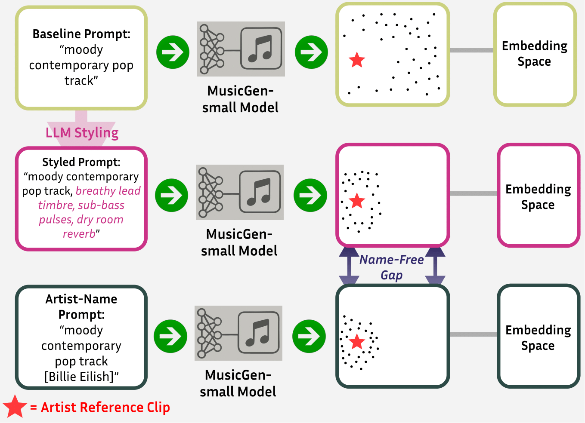

# The Name-Free Gap: Policy-Aware Stylistic Control in Music Generation — Demo

This page hosts generations from the experiments in "The Name-Free Gap: Policy-Aware Stylistic Control in Music Generation". We include short 15-second clips generated by a public model (no copyrighted reference audio).

## Billie Eilish (Vocal Pop)

### Baseline Prompts
*"a moody contemporary pop track with subtle electronic textures, minimal percussion, and an atmospheric groove"*

<audio controls>
  <source src="audio/billie_baseline_1.wav" type="audio/wav">
</audio>
<audio controls>
  <source src="audio/billie_baseline_2.wav" type="audio/wav">
</audio>
<audio controls>
  <source src="audio/billie_baseline_3.wav" type="audio/wav">
</audio>

### Artist Name Baselines
*"a moody contemporary pop track with subtle electronic textures, minimal percussion, and an atmospheric groove [Billie Eilish]"*

<audio controls>
  <source src="audio/billie_artist_1.wav" type="audio/wav">
</audio>
<audio controls>
  <source src="audio/billie_artist_2.wav" type="audio/wav">
</audio>
<audio controls>
  <source src="audio/billie_artist_3.wav" type="audio/wav">
</audio>

### Styled Prompts (Set 2)
*"a moody contemporary pop track with subtle electronic textures, minimal percussion, and an atmospheric groove, close-mic lead timbre, sparse percussion, intimate mix space"*

<audio controls>
  <source src="audio/billie_styled_1.wav" type="audio/wav">
</audio>
<audio controls>
  <source src="audio/billie_styled_2.wav" type="audio/wav">
</audio>
<audio controls>
  <source src="audio/billie_styled_3.wav" type="audio/wav">
</audio>

---

## Ludovico Einaudi (Instrumental Piano)

### Baseline Prompts
*"contemporary instrumental track with gentle dynamics, melodic progression, and subtle harmonic textures"*

<audio controls>
  <source src="audio/einaudi_baseline_1.wav" type="audio/wav">
</audio>
<audio controls>
  <source src="audio/einaudi_baseline_2.wav" type="audio/wav">
</audio>
<audio controls>
  <source src="audio/einaudi_baseline_3.wav" type="audio/wav">
</audio>

### Artist Name Baselines
*"contemporary instrumental track with gentle dynamics, melodic progression, and subtle harmonic textures [Ludovico Einaudi]"*

<audio controls>
  <source src="audio/einaudi_artist_1.wav" type="audio/wav">
</audio>
<audio controls>
  <source src="audio/einaudi_artist_2.wav" type="audio/wav">
</audio>
<audio controls>
  <source src="audio/einaudi_artist_3.wav" type="audio/wav">
</audio>

### Styled Prompts (Set 1)
*"contemporary instrumental track with gentle dynamics, melodic progression, and subtle harmonic textures, solo piano texture, repetitive arpeggios, classical reverb"*

<audio controls>
  <source src="audio/einaudi_styled_1.wav" type="audio/wav">
</audio>
<audio controls>
  <source src="audio/einaudi_styled_2.wav" type="audio/wav">
</audio>
<audio controls>
  <source src="audio/einaudi_styled_3.wav" type="audio/wav">
</audio>

---

## Paper Abstract

Text-to-music models capture broad attributes such as instrumentation or mood, but fine-grained stylistic control remains an open challenge. Existing stylization methods typically require retraining or specialized conditioning, which complicates reproducibility and limits policy compliance when artist names are restricted. We study whether lightweight, human-readable modifiers sampled from a large language model can provide a policy-robust alternative for stylistic control. Using MusicGen-small, we evaluate two artists: Billie Eilish (vocal pop) and Ludovico Einaudi (instrumental piano). For each artist, we use fifteen reference excerpts and evaluate matched seeds under three conditions: baseline prompts, artist-name prompts, and five descriptor sets. All prompts are generated using a large language model. Evaluation uses both VGGish and CLAP embeddings with distributional and per-clip similarity measures, including a new min-distance attribution metric. Results show that artist names are the strongest control signal across both artists, while name-free descriptors recover much of this effect. This highlights that existing safeguards such as the restriction of artist names in music generation prompts may not fully prevent style imitation. Cross-artist transfers reduce alignment, showing that descriptors encode targeted stylistic cues. We also present a descriptor table across ten contemporary artists to illustrate the breadth of the tokens. Together these findings define the name-free gap, the controllability difference between artist-name prompts and policy-compliant descriptors, shown through a reproducible evaluation protocol for prompt-level controllability.

---

## Links

**📊 Dataset & Artifacts:** [HuggingFace Dataset](https://huggingface.co/datasets/ArtisticStyling/music-style-control-data)  
**💻 Code Repository:** [GitHub Repository](https://github.com/artisticstyles/artisticstyles-neurips)

---

*This page contains only generated audio - no copyrighted material. Complete reproducibility artifacts available in the links above.*
